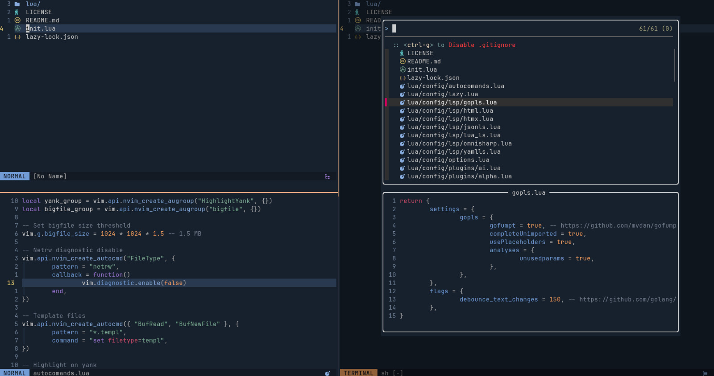

# My Neovim Configuration

This is my personal Neovim setup, tailored for a fast and minimal development workflow.

## Installation

1. Clone the repo:

   ```bash
   git clone https://github.com/marianozunino/nvim.git ~/.config/nvim
   ```

2. Set up Git hooks (optional but recommended):
   If you'd like to automatically format Lua files before committing, configure Git to use the custom `.githooks` directory:

   ```bash
   git config core.hooksPath .githooks
   ```

3. Make sure that `stylua` is installed via Mason:

   ```bash
   :MasonInstall stylua
   ```

   This configuration relies on `stylua` being installed by Mason at `~/.local/share/nvim/mason/bin/stylua`.

4. Open Neovim:

   ```bash
   nvim
   ```

   

## License

This configuration is available under the [MIT License](LICENSE).
